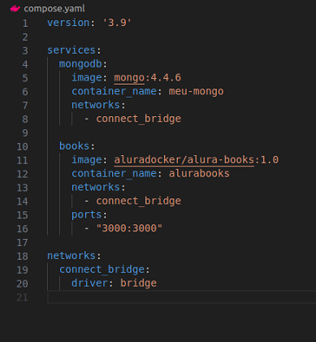
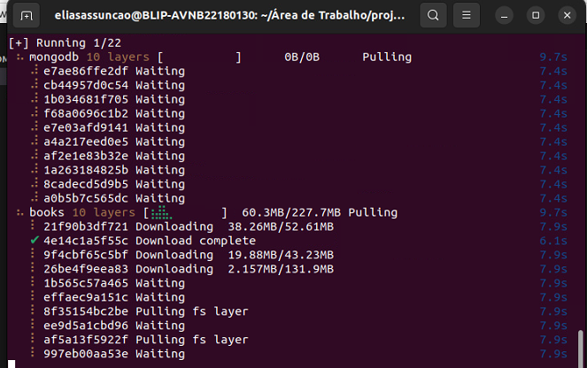
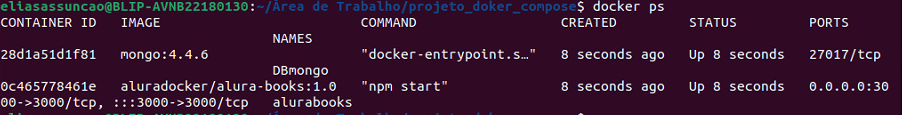
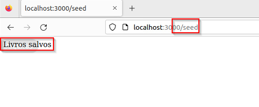
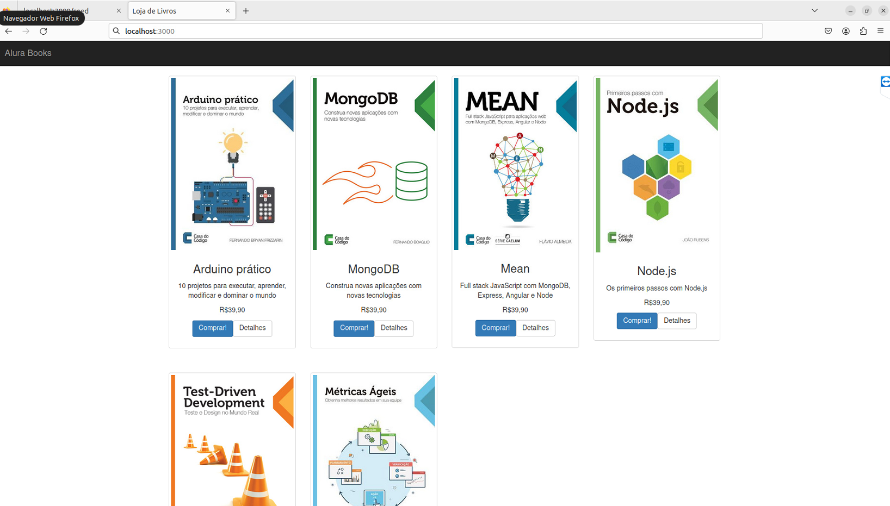

# DOCKER COMPOSE "Hospedando um site com banco de dados Mongodb"


**Objetivo**:

O principal propósito deste projeto é utilizar o Docker Compose para facilitar a subida de multiplos containers e hospedagem de um site que requer um banco de dados MongoDB. Por meio da utilização do Docker Compose, buscamos simplificar o processo de implantação e gerenciamento da infraestrutura necessária para o funcionamento do site e do banco de dados. 


## 📌 Requisitos

Certifique-se de ter o Docker instalado no seu sistema. Se necessário, você pode seguir o link da documentação oficial [Como instalar o Docker](https://docs.docker.com/engine/install/)


## 📦 Documentação

**Criação do YAML**

Um arquivo YAML do Docker Compose é um documento de configuração que descreve os serviços, redes e volumes necessários para executar aplicativos Docker. Ele serve como um plano para o Docker Compose, indicando quais contêineres devem ser executados, quais portas devem ser expostas e como os diferentes componentes devem se comunicar entre si. Assim em vez de ficar subindo container por container ou criando rede e configurando, centralizamos tudo em apenas um arquivo.



*services (serviços):* Define os diferentes contêineres que compõem sua aplicação, cada um representado por um serviço. Cada serviço é configurado com suas próprias propriedades, como a imagem a ser usada, portas expostas, variáveis de ambiente, volumes montados, etc.

*networks (redes):* Permite configurar redes personalizadas para conectar os contêineres entre si, ou com outros serviços ou redes externas.

*volumes (volumes):* Especifica os volumes a serem montados nos contêineres, permitindo persistência de dados ou compartilhamento de arquivos entre contêineres ou com o host.

*version (versão):* Define a versão da especificação do Docker Compose utilizada no arquivo. Isso afeta a sintaxe e os recursos disponíveis.


**Subindo nossos containers com o docker compose**

Apos a criação do nosso arquivo yaml, subir nossos containers de uma vez so. Para isso vamos utilizar o comando:

```
docker compose up -d

```
Flag: -d para rodar o container em modo deamon




**Validando a criação dos nossos containers**

Para verificar se todos os containers subiram corretamente, podemos utilizar o seguinte comando

```
docker ps
```



Assim conseguimos ver que os nosso containers estão rodando

**Nossa aplicação funcionando corretamente**

Para carregar nosso banco no nosso site, vamos acessar nossa aplicação no 3000/seed




Logo apos, podemos acessar nossa aplicação para ver o resultado.




⌨️ com ❤️ por [Elias Assunção](https://github.com/Hooligam) 🔥

